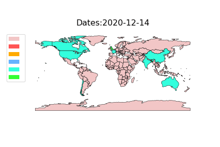

# ECE143-Final-Project
This is repository for ECE143 Group 7's Final Project. 


## Notebook for the test cases

Our notebook for the functional/validation tests is in the file `./test.ipynb`.


## Setup the environment

Please install the packages by 

```bash
conda create -n test143 python=3.8
pip install -r requirements.txt
```

 **The depandencies and third-party modules are listed in the `requirements.txt` file.**

To dowload Nltk packages run this in Python shell:
```
import nltk

nltk.download([
...     "names",
...     "stopwords",
...     "state_union",
...     "twitter_samples",
...     "movie_reviews",
...     "averaged_perceptron_tagger",
...     "vader_lexicon",
...     "punkt",
... ])
```

**The file structures are shown at the end of this repository.** 

## Jupyter Notebook for images

* Spatial temporal heat map: 

  Please refer to the notebook `heat_map.ipynb`.

## Sentiment Analysis

Navigate to sentiment_prediction

Create directories to save data by running
```
mkdir dataset/aggregations_all
mkdir dataset/plots
```

To get sentiment of each tweet, run
```
python tweet_sentiment_analysis.py
```

To get sentiment of tweets by user occupation, run
```
python tweet_analysis_by_profession.py
```

To generate sentiment pie-chart, run
```
python aggregate_plots.py
```

To generate occupation-wise sentiment bar-graph, run
```
python plots_profession.py
```

## Polarity vs Subjectivity Analysis of tweets

Please enter the Polarity_vs_Subjectivity_Analysis directory and run the notebook using Google Colab environment. The instructions for doing this are as follows: 

1. Upload the notebook to your google drive
2. Go into directory "Colab Notebooks"
3. Choose **New** --> **File upload**
4. After uploading, click on the new file
5. Select the option **Run on Colaboratory** at the top.


## Spatial Temporal analysis

Please enter the `HEATMAP_processing` directory and change the path as instructed below. (If you utilize our default repository setting, you should be able to directly run the command.)

Change the `world_path` to the path to store all the geopandas data and change `sentiment_score_file_path` to the path storing the csv file with preprocessed sentiment scores and change `vaccine_file_path` to the path storing the original csv file which will be utilized to extract country information.

After changing the path, please run the flollowing command

```bash
python heat_map.py
```

If you want to generate the gif, please utilize the `generateGif()` function. And you would get the `gif` as below:




## File structures

The file structures are shown below. Each folder contains the separate `.py` scripts for running the 

For example, in the folder `HEATMAP_processing`, you can run the scripts for generating the Spatial Temporal analysis gif images as shown above. 

```
.
├── Group7-Final-Presentation.pdf
├── HEATMAP_processing
│   ├── 1.gif
│   ├── Untitled.ipynb
│   ├── data
│   │   ├── capital.dbf
│   │   ├── capital.prj
│   │   ├── capital.qpj
│   │   ├── capital.shp
│   │   ├── capital.shx
│   │   ├── country.dbf
│   │   ├── country.prj
│   │   ├── country.qpj
│   │   ├── country.shp
│   │   ├── country.shx
│   │   ├── gran_agg.csv
│   │   ├── graticule.dbf
│   │   ├── graticule.prj
│   │   ├── graticule.qpj
│   │   ├── graticule.shp
│   │   ├── graticule.shx
│   │   ├── tot_agg.csv
│   │   ├── tweet_sentiment_005.csv
│   │   ├── tweet_sentiment_all_001.csv
│   │   ├── vaccination_all_tweets.csv
│   │   └── vaccination_all_tweets_test.csv
│   ├── heat_map.ipynb
│   ├── heat_map.py
│   └── requirements.txt
├── Polarity_vs_Subjectivity_Analysis
│   └── Tutorial1_sentiment_analysis.ipynb
├── Profession_based_sentiment_analysis
│   ├── Dataset_splits
│   │   ├── healthcare_workers.csv
│   │   ├── media_corporations.csv
│   │   └── media_users.csv
│   ├── profession_based_split.py
│   └── vaccination_all_tweets.csv
├── README.md
├── requirements.txt
├── sentiment_prediction
│   ├── aggregate_plots.py
│   ├── csv_data_parser.py
│   ├── dataset
│   │   ├── healthcare_workers.csv
│   │   ├── media_corporations.csv
│   │   ├── media_users.csv
│   │   ├── negative-words.txt
│   │   ├── positive-words.txt
│   │   └── vaccination_all_tweets.csv
│   ├── plots_profession.py
│   ├── tweet_analysis_by_profession.py
│   └── tweet_sentiment_analysis.py
└── test.ipynb.
├── Group7-Final-Presentation.pdf
├── HEATMAP_processing
│   ├── 1.gif
│   ├── data
│   │   ├── capital.dbf
│   │   ├── capital.prj
│   │   ├── capital.qpj
│   │   ├── capital.shp
│   │   ├── capital.shx
│   │   ├── country.dbf
│   │   ├── country.prj
│   │   ├── country.qpj
│   │   ├── country.shp
│   │   ├── country.shx
│   │   ├── gran_agg.csv
│   │   ├── graticule.dbf
│   │   ├── graticule.prj
│   │   ├── graticule.qpj
│   │   ├── graticule.shp
│   │   ├── graticule.shx
│   │   ├── tot_agg.csv
│   │   ├── tweet_sentiment_005.csv
│   │   ├── tweet_sentiment_all_001.csv
│   │   ├── vaccination_all_tweets.csv
│   │   └── vaccination_all_tweets_test.csv
│   ├── heat_map.py
│   ├── img
│   └── requirements.txt
├── Polarity_vs_Subjectivity_Analysis
│   └── Tutorial1_sentiment_analysis.ipynb
├── Profession_based_sentiment_analysis
│   ├── Dataset_splits
│   │   ├── healthcare_workers.csv
│   │   ├── media_corporations.csv
│   │   └── media_users.csv
│   ├── Input_dataset
│   │   └── vaccination_all_tweets.csv
│   ├── login.csv
│   └── profession_based_split.py
├── README.md
├── requirements.txt
├── sentiment_prediction
│   ├── aggregate_plots.py
│   ├── csv_data_parser.py
│   ├── dataset
│   │   ├── healthcare_workers.csv
│   │   ├── media_corporations.csv
│   │   ├── media_users.csv
│   │   ├── negative-words.txt
│   │   ├── positive-words.txt
│   │   └── vaccination_all_tweets.csv
│   ├── plots_profession.py
│   ├── tweet_analysis_by_profession.py
│   └── tweet_sentiment_analysis.py
└── test.ipynb
```


